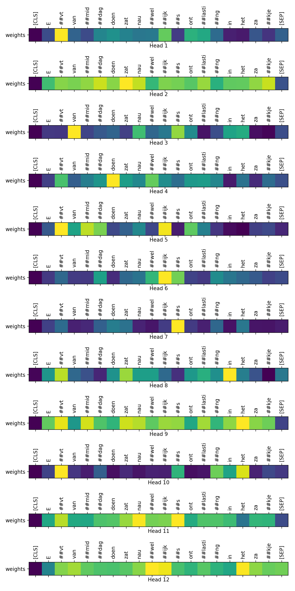

# Text classification

Classifying patient illness name by nurse notes (Dutch).

## Method: 
Two type methods are applied:
1. <b> Using non-transformer methods </b>:
   - preprocessing text
   - applying:
     - word embedding + globalAveraged1D
     - Or word embedding + convolutional 1D
     - Or word embedding + convolutional 2D
     - Or bidirectional LSTM
     - Or FastText (n-gram based on character-level)
2. <b> Transformer-based methods</b>:
   - BERT
   - XLMRoberta

## Result:
Below shows the last attention layer for BERT:\

## File structure:
- data:
  - [transformer_bert_data_gen.py](data/transformer_bert_data_gen.py): generating train/dev/test text for BERT
- result:
  - [conv1d](result/conv1d): reult for `embedding + convolutional 1D` method
  - [result_XLMRoberta](result/result_XLMRoberta): result for XLMRoberta
  - transformer_bert_layer0/11: attention plot for first and last layer
  - [transformer_distilledBert](result/transformer_distilledBert): esult for distilledBert

- [preproc.py](preproc.py): preprocessing text
- [transformer_classifier_tf.py](transformer_classifier_tf.py):
  - transfromer for tensorflow
- [transformer_classifier_torch.py](transformer_classifier_torch.py):
  - transformer for PyTorch
- [transformers_tools.py](transformers_tools.py):
  - help functions for transformers
- [word_embedding_methods.py](word_embedding_methods.py):
  -  non-transformer methods:
     - word embedding + globalAveraged1D: `python --train_type simple`
     - Or word embedding + convolutional 1D: `python --train_type conv1d`
     - Or word embedding + convolutional 2D: `bashpython --train_type conv2d`
     - Or bidirectional LSTM: `python --train_type bidireLSTM`
     - Or FastText (n-gram based on character-level): `python --fasttext True`

